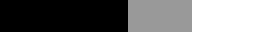
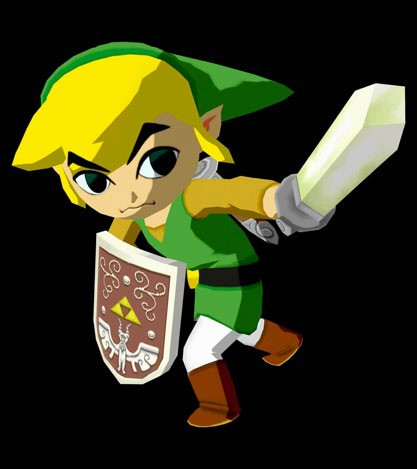
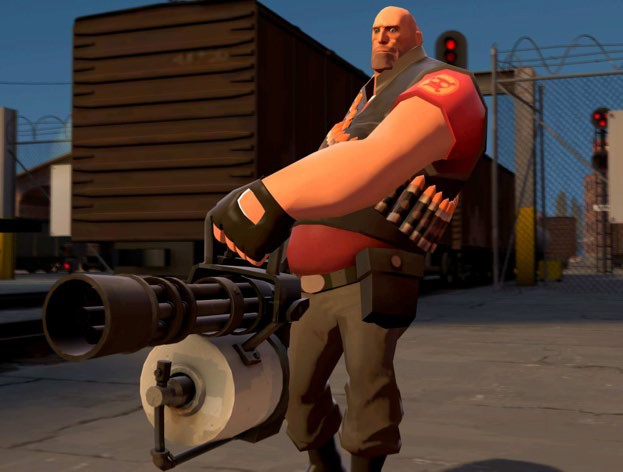
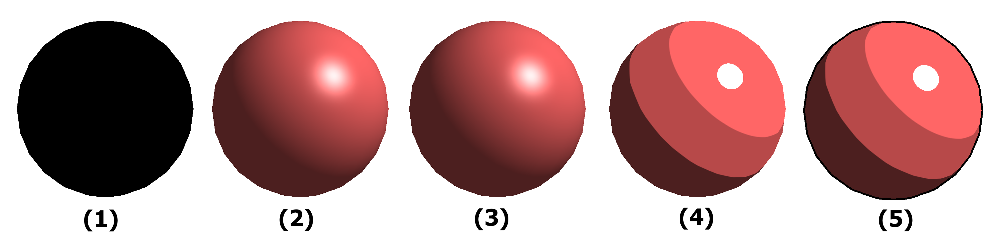

# Assignment 5: Artistic Rendering

**Due: Monday, November 21, 11:59pm CDT**

GLSL shaders make it possible for us to create some amazing lighting effects in real- time computer graphics. These range from photorealistic lighting to artistically inspired non-photorealistic rendering, as featured in games like *The Legend of Zelda: Breath of the Wild* and *Team Fortress 2*. In this assignment, you will implement GLSL shaders that can produce cartoon shading with a silhouette outline to complete the artistic effect.  You will also complete the implementation of a normal mapping shader that can render photorealistic textures on surfaces to make them appear more detailed and complex.

In this assignment, you will learn:

- How to calculate artistic per-pixel lighting in real-time.
- How to modify geometry on the fly to create viewpoint-dependent effects such as silhouette outlines.
- How to manipulate per-pixel normals to create the illusion of more complex surfaces.
- How to implement and use your own shader programs!

You can try out the [instructor's implementation](https://csci-4611-fall-2022.github.io/Builds/Assignment-5) in the Builds repository on the course GitHub.

## Submission Information

You should fill out this information before submitting your assignment. Make sure to document the name and source of any third party assets that you added, such as models, images, sounds, or any other content used that was not solely written by you. 

Name:

Third Party Assets:

Wizard Bonus Functionality:

## Prerequisites

To work with this code, you will first need to install [Node.js 16.17.0 LTS](https://nodejs.org/) (or newer) and [Visual Studio Code](https://code.visualstudio.com/). 

## Getting Started

The starter code implements the general structure that we reviewed in lecture.  After cloning your repository, you will need to set up the initial project by pulling the dependencies from the node package manager with:

```
npm install
```

This will create a `node_modules` folder in your directory and download all the dependencies needed to run the project.  Note that this folder is `.gitignore` file and should not be committed to your repository.  After that, you can compile and run a server with:

```
npm run start
```

The build system should launch your program in a web browser automatically.  If not, you can run it by pointing your browser at `http://localhost:8080`.

## Requirements

We provide code for loading several 3D model files, rotating them on the screen using the mouse, and toggling between multiple shading models.  The implementation of Gouraud shading, Phong shading, unlit shading, and wireframe shading is already complete, using the out-of-the-box shaders provided by GopherGfx.  The basic structure for cartoon shading and normal map shading has been provided, and all the necessary inputs have already been passed to each shader program. 

For this assignment, you **only** need to modify the GLSL code in the .vert and .frag shader programs.  You will not need to modify the TypeScript code to complete this assignment. However, as always, you are welcome to add to the TypeScript code if you want to add additional wizard functionality.

There are three shader mini-programs that you need to complete:

1. Complete the `toon.frag` fragment shader to correctly calculate the per-pixel toon shading, using the *diffuseRamp.png* and *specularRamp.png* textures to control the illumination.
2. Complete the `outline.vert` vertex shader to draw a black silhouette outline of the mesh when rendering with the toon shader.
3. Complete the `normal.vert` vertex shader to compute the matrix that will convert vertices into the coordinate space required for normal mapping.
4. Complete the `normal.frag` fragment shader to correctly calculate the displaced per-pixel normal as defined in the normal map.

## Useful Resources

In class, we will work on some shader programs that compute ambient, diffuse, and specular lighting using per-vertex (Gouraud) and per-pixel (Phong) shading.  You should start by looking at the implementation of these shaders to learn both the general structure and GLSL syntax.  You can find the source code for all the [GopherGfx shaders](https://github.com/illusioneering/GopherGfx/tree/main/src/shaders) on GitHub.  If you are having trouble understanding how these shaders work, please make an appointment for office hours or seek help on Piazza/Slack.

The [OpenGL 3.0 ES API Reference Card](https://www.khronos.org/files/opengles3-quick-reference-card.pdf) provides a compact and useful resource for all the various functions provided by GLSL.  Note that the first three pages can be ignored, and the content relevant to GLSL is on pages 4-6.

## Artistic Cartoon Shading Using Texture Images

The `toon.vert` vertex shader is identical to the one used in Phong shading, and you do not need to modify it.  However, the `toon.frag` fragment shader just sets the color of every pixel to black.  As a first step, you should copy the body of the [Phong fragment shader](https://github.com/illusioneering/GopherGfx/blob/main/src/shaders/phong.frag) into the `main()` function. You can then adapt the shader to implement cartoon-style shading. Rather than setting the final color based on the intensity of light calculated for the Phong model, you will instead use this intensity value as a lookup into a texture, and use that to compute the final color. A texture used in this way is typically called a "ramp." Using this strategy, you will be able to get a wide range of different lighting effects just by switching the texture you use for input.

Suppose that we use the dot product in the diffuse term, **n** &middot; **l**, to look up the texture.  Because this value represents the cosine of the angle between the two vectors, it will range from -1 to 1. We need to map this value to a texture coordinate, which will range from 0 to 1. 

If we use `standardDiffuse.png`, which is zero in the left half corresponding to negative **n** &middot; **l**, and increases linearly from 0 to 1 for positive **n** &middot; **l**, then we will get back the standard diffuse lighting term, and the object will have the same appearance as the Phong shader.


But, if we use `toonDiffuse.png`, we will get something that looks like a cartoon, as if an artist were shading using just three colors of paint.



Note that this is the same type of lighting effect you see in many games, as shown below.  *The Legend of Zelda: The Wind Waker* uses a very simplified light model. In this example, it looks like there are just two values used in the shading: each surface is either in bright light or dark. *Team Fortress 2* is a bit more subtle: it reduces the brightness variation in lit areas without completely flattening them out. You can read more about this in *Illustrative Rendering in Team Fortress 2* by Mitchell et al., linked in the Further Reading section at the bottom of the document.





Inside the code copied from the Phong shader, you will have equations that calculate the intensity of reflected light for ambient, diffuse, and specular components. For the diffuse portion, the key quantity will be **n** &middot; **l**, which should range from −1 to 1. This is the value that you want to use to lookup the lighting color to apply from the texture ramp. If the value of **n** &middot; **l** is −1, then you want to use the color on the leftmost side of the texture. If it is 1, then you want to use the color on the rightmost side of the texture. That means your *x* texture coordinate for this lookup will be 0.5 * (**n** &middot; **l**) + 0.5, because texture coordinates only go from 0 to 1. For the *y* texture coordinate, you can use 0 or any other value, because the color only varies from left to right. After calculating these texture coordinates, you can get the color from the texture ramp using the GLSL built-in function `texture()`. You can find an example at the end of the `main()` function, where the color is applied from the texture image using the *uv* coordinates passed into the shader.

For the specular component, the dot product is clamped to positive values anyway before taking the exponent, so you should directly use the intensity as the texture coordinate without rescaling.  Therefore, the texture ramp lookup will be max(**e** · **r**, 0)<sup>shininess</sup>.

## Reference Images

At this point, you should check your result against the following reference images. There is a very simple model of a sphere available in the support code. The results of your program on this mesh should look like the following as you progress through the assignment:



1. The sphere with no shading implemented.
2. The sphere with Phong shading provided by GopherGfx.
3. Cartoon shading with `standardDiffuse.png` and `standardSpecular.png`. This should be identical to the Phong shader. To test this, you can switch the texture ramps loaded by the shader in the constructor of `MeshViewer.ts`.
4. Cartoon shading with `toonDiffuse.png` and `toonSpecular.png`.
5. Cartoon shading with a thin silhouette outline. This will be implemented in the next part of this assignment. Note that the default value in the assignment code creates a much thicker outline than displayed in this image.

## Silhouette Outline Shading

There are various ways to draw silhouette contours on 3D shapes. In this assignment, we use a simple and elegant method that uses OpenGL stencil testing.  Once the fragment shader has processed the fragment, a stencil test can be executed that has the option to discard fragments. The stencil test is based on the content of yet another buffer called the stencil buffer that we are allowed to update during rendering to achieve interesting effects.

A stencil buffer (usually) contains 8 bits per stencil value that amounts to a total of 256 different stencil values per pixel. We can set these stencil values to values of our liking, and we can discard or keep fragments whenever a particular fragment has a certain stencil value.


In this case, we only assign two possible values in the stencil buffer. First, the stencil buffer is initialized to all zeros. When the object is drawn using the cartoon shader, any pixels that are rendered by the fragment shader have their corresponding value in the stencil buffer set to one.  

Next, we render the same object using the outline shader.  The `outline.vert` vertex shader slightly enlarges the object by a specified thickness, and the `outline.frag` shader colors every pixel as solid black. However, the magic occurs because of the stencil test... any fragments that have been set to a value of one in the stencil buffer are discarded.  This results in black pixels that form a silhouette outline of the object, but none of the pixels that were originally rendered by the cartoon shader will be modified!

In this part, you will only need to modify the code in `outline.vert`. The shader code contains detailed comments that describes all the steps you will need to implement. Note that you will need to convert the vertex position and normal from world space into view space, apply computations to displace the vertex in the correct direction and distance, and then project this position into screen coordinates. If you are not sure of how to do this, then please review the course content from the lecture on the graphics pipeline and shader programs, where we will go through the transformations between all these coordinate spaces in detail.

## Normal Map Shading

Normal mapping is an approach that can provide an incredible boost in surface detail for a relatively low cost. The implementation in this assignment is based on the approach described in this [Learn OpenGL tutorial](https://learnopengl.com/Advanced-Lighting/Normal-Mapping). As in the previous shaders, the overall structure has been implemented in the starter code, and both the `normal.vert` and `normal.frag` shaders contain code sections that are marked for you to complete.

For this part, you should first read through the detailed description of the approach provided in the above tutorial. Note that this article includes GLSL reference code, and in this specific case you are **allowed** to copy and adapt it for your shader program.

To complete the vertex shader, you will need to compute the TBN matrix that will be used to convert everything from world space into **tangent space**, the coordinate system used by the normal maps.  As described in the tutorial, you will need three vectors to construct this matrix: the tangent, bitangent, and normal. The tangent and normal vectors (in object space) are already passed into the shader, and you will need to convert them to world space using the normal matrix, as discussed in class.. Then, you can compute the bitangent vector using the Gram-Schmidt process and construct the TBN matrix, as demonstrated in code near the end of the tutorial.

The rest of the shader code is already complete. The TBN matrix is used to convert the vertex position, eye position, and light positions into tangent space, and then all of these variables are passed on to the fragment shader. Before moving on to complete the fragment shader, you should first check that your vertex shader code is correct.  The easiest way to do this is to run the application, select normal map shading, and then choose one of the texture images to apply to the mesh. The initial TBN matrix provided in the starter code is an identity matrix, and this produces a result that looks similar to the unlit shading mode. After you have computed the correct TBN matrix, the textured mesh will look identical to Phong shading.

To complete the fragment shader, you will need to look up the displaced normal from the normal map using the `texture()` function and then rescale it into the correct range. This process is also described in the tutorial. When you are finished, the textured surface of the mesh will appear less flat and much more realistic!

## Rubric

Graded out of 20 points. 

**Part 1: Toon Shader** (5 points total)

- Set up the initial fragment shader by adapting code from the Phong shader (1)
- Compute and apply the diffuse component using a lookup into the `diffuseRamp` texture. (2)

- Compute and apply the specular component using a lookup into the `specularRamp` texture. (2)

**Part 2: Silhouette Shader** (5 points total)

- Calculate the vertex position and normal in view space (2)

- Displace the view space position by the correct direction and distance (2)
- Project the final position into screen coordinates for output to the fragment shader (1)

**Part 3: Normal Map (Vertex Shader)** (6 points total)

- Calculate the tangent and normal vectors in world space (2)
- Calculate the bitangent vector (2)
- Construct the TBN matrix (2)

**Part 4: Normal Map (Fragment Shader)** (4 points total)

- Look up the fragment normal in the normal map (2)
- Rescale the fragment normal into the correct range (2)

## Wizard Bonus Challenge

All of the assignments in the course will include great opportunities for students to go beyond the requirements of the assignment and do cool extra work. On each assignment, you can earn **one bonus point** for implementing a meaningful new feature to your program. This should involve some original new programming, and should not just be something that can be quickly implemented by copying and slightly modifying existing code.  

Once you get the hang of them, shaders can be really fun! You can use them to implement other cool effects like adding stripes, waves, random noise, or bumps to the surface. For this assignment only, after you complete the base requirements, you can look up additional resources or shader code examples on the internet and use them to implement new visual effects for the bonus challenge. However, please make sure to read the academic integrity reminder below,

## Academic Integrity Reminder

Shaders are hard to learn and you will find tons of resources, examples, and other information online. You would defeat the purpose of the assignment if you use these online resources to complete the core program (and break our course rules). To solve the core assignment, you must **only** use our course materials, the specific tutorials referenced in this document, and the [official GLSL documentation](https://docs.gl). However, **after** you have successfully completed the core assignment, if you then wish to continue working on Wizardly extensions, then it is fine to use online resources to continue learning more about shaders and/or even implement examples that you find on the internet. However, if you are inspired by or copy and modify code from elsewhere, you must **cite your sources** in your README file and any describe how you used them in any additional shaders that you create. Aside from any licensing issues that may surround the code you are using, we need you to cite your sources and inspirations so that we may accurately understand how much of your wizardly work represents your own intellectual contribution.

## Submission

When you commit and push your assignment to GitHub, an automated script will build and deploy the production code to the `gh-pages` branch of your repository.  However, your submission is not complete until you do the following:

1. Open your repository on GitHub and go to Settings->Pages.
2. Change the source to the `gh-pages` branch, then save.

You will need to wait a few minutes for the website to deploy.  After that, make sure to test everything by pointing your web browser at the link generated for your build:

```
https://csci-4611-fall-2022.github.io/your-repo-name-here
```

If your program runs correctly, then you are finished!  The published build will indicate to the TAs that your assignment is ready for grading.  If you change your mind and want to make further changes to your code, then just delete the `gh-pages` branch and set the GitHub pages source back to `None`, and it will unpublish the website.

Note that the published JavaScript bundle code generated by the TypeScript compiler has been minified so that it is not human-readable. So, you can feel free to send this link to other students, friends, and family to show off your work!

## Further Reading

You do not need to read these articles to implement the assignment. They are only provided in case you are curious and want to learn more about non-photorealistic rendering.

- Mitchell, Francke, and Eng, [Illustrative Rendering in Team Fortress 2](https://valvearchive.com/archive/Other%20Files/Publications/NPAR07_IllustrativeRenderingInTeamFortress2.pdf), *Non- Photorealistic and Artistic Rendering*, 2007. 
- Gooch, Gooch, Shirley, and Cohen, [A Non-Photorealistic Lighting Model for Automatic Technical Illustration](https://users.cs.northwestern.edu/~ago820/SIG98/abstract.html), *SIGGRAPH*, 1998. 
- Card and Mitchell, [Non-Photorealistic Rendering with Pixel and Vertex Shaders](http://developer.amd.com/wordpress/media/2012/10/ShaderX_NPR.pdf), *ShaderX: Vertex and Pixel Shaders Tips and Tricks*, 2002.

## Acknowledgments

- This assignment was based on content from CSCI 4611 Fall 2021 by [Daniel Keefe](https://www.danielkeefe.net/).
- The PBR textures were from [3dtextures.me](https://3dtextures.me/). 
- Explanations and images were adapted from the Learn OpenGL articles on [stencil testing](https://learnopengl.com/Advanced-OpenGL/Stencil-testing) and [normal mapping](https://learnopengl.com/Advanced-Lighting/Normal-Mapping).

## License

Material for [CSCI 4611 Fall 2022](https://csci-4611-fall-2022.github.io/) by [Evan Suma Rosenberg](https://illusioneering.umn.edu/) is licensed under a [Creative Commons Attribution-NonCommercial-ShareAlike 4.0 International License](http://creativecommons.org/licenses/by-nc-sa/4.0/).
